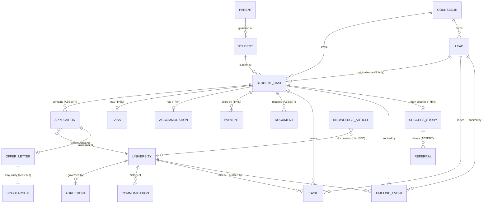

# File 24 — The RichenQuest domain model

**Purpose:** one place that says what exists in the business, where it lives, who owns it, and
what is not modelled yet. Written before more automation, because automation built on an
unexamined domain model is what you rewrite at 100x.

**Grounding:** every "lives in" below was read from the live tenancy on 2026-08-15, not assumed.
39 API-supported modules, **zero custom modules**. `Deals` is already relabelled *Student Cases*.

---

## 1. Entity register

Legend — **Live**: modelled and in use · **Thin**: exists only as a field or picklist value ·
**Absent**: not modelled at all.

| # | Entity | Lives in | State | Owner | Notes |
|---|---|---|---|---|---|
| 1 | **Lead** | `Leads` | Live | Counselor | 4 records. Never deleted or converted (File 01 §5.2) |
| 2 | **Student** | `Contacts` | **Live** (2026-08-15) | Counselor | Closed by `resolveStudent`; see §3 G-1 |
| 3 | **Parent** | `Contacts` | Absent | Counselor | Payer and decision-maker; currently invisible |
| 4 | **Counselor** | `Users` + `Roles` | **Thin** | CEO | Role exists, **no user holds it** |
| 5 | **University** | `Accounts` | Live | Partnerships | 17 records, all `Identified` |
| 6 | **Partner** | `Accounts.Partnership_Type` | Live | Partnerships | Same module, typed |
| 7 | **Student Case** | `Deals` | Live (empty) | Counselor | 11 stages + journey axis (File 23) |
| 8 | **Application** | — | **Absent** | Counselor | See §3 — one case has many applications |
| 9 | **Offer Letter** | — | Absent | Counselor | Document + decision, neither modelled |
| 10 | **Visa** | `Deals.Visa_Status` | Thin | Counselor | Picklist only; no lodgement date, centre, or refusal reason |
| 11 | **Scholarship** | — | Absent | Counselor | Award amount and conditions unmodelled |
| 12 | **Accommodation** | `Deals.Student_Journey_Stage` | Thin | Operations | Records *that* it happened, not what or where |
| 13 | **Payment** | Zoho Books | **Thin** | Finance | Books org is in **test mode** (File 16 §2) |
| 14 | **Invoice** | `Invoices` / Books | Absent | Finance | Module exists, unused |
| 15 | **Agreement** | `Accounts.Agreement_*` | Live | Partnerships | Full lifecycle (File 21) |
| 16 | **Document** | — | **Absent** | Operations | No WorkDrive API probed. See §3 |
| 17 | **Task** | `Tasks` | Live | assignee | Created only via `createFollowUpTasks` |
| 18 | **Communication** | `Notes` `[contact]` | Live | actor | `logPartnershipContact` |
| 19 | **Timeline Event** | `Notes` `[audit]` | Live | system | `generateAuditLog` |
| 20 | **Knowledge Article** | `Solutions` | **Available, unused** | Operations | See §4 — this is Priority 6's home |
| 21 | **Success Story** | journey stage | Thin | Marketing | Consent-gated; deliberately not automated |
| 22 | **Referral** | — | Absent | Counselor | The obvious use of Alumni; nothing exists |
| 23 | **Alumni** | journey stage | Thin | Marketing | Dead end today |
| 24 | **Support Ticket** | `Cases` | Available, unused | Support | Module exists |

**Score: 10 live, 7 thin, 7 absent.** The platform is strong on *relationship* entities
(University, Agreement, Case, Task, Audit) and weak on *delivery* entities (Application, Offer,
Document, Payment) — which is the half that carries the operational load at scale.

---

## 2. Entity relationship diagram



---

## 3. The four gaps that matter, in priority order

### G-1 · Student identity — **CLOSED 2026-08-15**

Was: a Student Case carried the student's name as *free text* and `Contacts` was empty. The same
person applying twice — deferred intake, master's after bachelor's — became two unrelated records
with nothing joining them. No "everything about this student" view, no parent link, no alumni
identity, and nothing a portal login could bind to.

**Fixed** by `resolveStudent`, a find-or-create identity service, now called by
`createStudentCase` (v2.0). The Case links to the Contact via `Contact_Name`.

**Identity rule, in order:** `email` → `phone` → create. **Never match on name alone** — two
students called "Aarav Sharma" are two students, and silently merging them is far worse than
holding a duplicate a human can merge later.

**Verified live:** two Student Cases created from separate calls (Germany and Ireland) both
resolved to the **same** `student_id`, with `student_created: false` on each — i.e. the second
application reused the first person rather than inventing a new one. Probes deleted.

`createStudentCase` now **fails closed**: if identity resolution fails, no Case is created. A case
without a student is precisely the orphan this change exists to prevent.

### G-2 · Application is not an entity

A case applies to **many** universities. Today `Course_University_Final` is one text field, so the
model can only express the outcome, never the process — and the process is the work.

**Consequence:** no per-university status, no offer comparison, no answer to "which universities
convert best for us", which is exactly the metric that should drive the partnership programme.

**RESOLVED 2026-08-15 — custom modules ARE available on this plan.** Tested end to end: module
created (`201`), lookups to `Deals`/`Accounts`/`Contacts` created, a record held a live university
lookup and was COQL-queryable, and the related list auto-appeared on the parent. Probe deleted.

**Decision: Application is a custom module (junction entity).** Full reasoning, including why not
Deals / Quotes / subforms, in **File 25 §G-5**. Architecture verified; implementation awaits an
agreed field list.

### G-3 · Document has no home

Document collection is a core service (SOP-03) and a File 01 §6 WorkDrive structure is specified,
but no WorkDrive API has been probed and no document entity exists. Attachments on records are the
zero-cost fallback.

**INVESTIGATED 2026-08-15 — WorkDrive is provisioned and has a working REST API**
(`workdrive.zoho.in/api/v1`, JSON:API), including `datatemplates` for custom file metadata. Deluge
reaches it natively: `zoho.workdrive.uploadFile` is a recognised integration task. `zoho.crm.attachFile`
also compiles, giving a zero-dependency fallback. Design in **File 25 §G-3**.

### G-4 · Money is in test mode

Books reports `org_type: test`. Every payment and invoice figure is fictional. Finance dashboards
cannot be built on it, and building them anyway would produce confident, wrong numbers.

**Founder-only boundary:** switching out of test mode and entering GST registration.

---

## 4. Knowledge platform — the module already exists

Priority 6 asks for a searchable internal corpus. Before proposing anything new: **`Solutions` is a
Zoho knowledge-article module and it is already available** on this plan, unused.

```
Solution_Title  Question  Answer  Status  Published  Tag  Product_Name  No_of_comments
```

That is an article store with a title, body, publication state and tags — enough for university
requirements, visa rules, SOPs and policies, searchable through the standard record APIs
(`searchRecords`, COQL) with no new infrastructure.

**Decision: the knowledge platform is `Solutions` plus an ingest function**, not a new system. The
corpus sources (ADRs, claims library, SOPs, automation docs) live in this repo as the authoring
surface; a function publishes them into `Solutions` so every client can search one place.

Not built yet. Recorded so it is not re-invented.

---

## 5. Ownership model

"Owner" means *who is accountable for the data being right* — not who has write permission.

| Domain | Data owner | API owner | Automation owner |
|---|---|---|---|
| Lead, Student Case, Student | Counselor | `resolveStudent`, `createStudentCase`, `updateStudentCaseStage`, `updateLeadLifecycle`, `advanceStudentJourney` | Instant lead response, Stale lead rescue |
| University, Agreement | Partnerships | `logPartnershipContact`, `renewPartnership`, `archiveExpiredPartnership`, `createUniversityFollowup`, `partnershipKPIs` | 4 partnership rules |
| Task | assignee | `createFollowUpTasks` | Overdue task reminder |
| Audit / Timeline | system — **nobody edits** | `generateAuditLog` | every mutating function |
| Validation | platform | `coreValidate` | — |
| Money | Finance | — | — (test mode) |
| Knowledge | Operations | — (planned: `Solutions`) | — |

**Rule:** an entity with no named API owner is an entity nobody can safely automate. Six rows are
still blank; that is the honest state.

---

## 6. Data governance

**Source of truth.** Zoho CRM, per ADR-003 — see **ADR-009** for whether that survives 100x.
The repo is the source of truth for *logic* (`functions/src/*.dg`) and *company facts*
(`claims.json`). Where CRM and repo disagree on logic, the repo wins and CRM is stale.

**Duplication policy.** One rule, one place. Enforced by convention, not by tooling:
- validation → `coreValidate` only
- task creation → `createFollowUpTasks` only
- audit → `generateAuditLog` only
- company facts → `claims.json` only, gated by `claims-guard` at build time

The one **known live violation** is recorded in File 22 §D-1: workflow rules still carry native
Task actions duplicating `createFollowUpTasks`, because binding rules to functions is licence-gated.
Its cost is measured — a stage change made in the UI fires the rule; the same change from Deluge
does not.

**Consent.** DPDP/GDPR require consent to be demonstrable. `Consent_Policy_Version` is captured on
every webform submission; `Consent_Given` and `Consent_Timestamp` exist in CRM but their webform
indices are unresolved, so the affirmative boolean is **inferred from a hard client-side gate, not
transmitted** (File 18 §5). Success stories are consent-gated and deliberately not automated.

**Retention.** Nothing is deleted. Leads go to `Nurture`, partnerships go `Dormant`, agreements go
`Expired`. No retention *policy* exists — at DPDP scale one will be required, and it is not
written. **Gap.**

**Auditability.** Every mutating function writes a `[audit]` Note carrying actor, from → to, and
reason. Notes are permission-scoped to the record and cannot be edited into a different history
without leaving traces.

**Versioning.** Functions carry a version in their doc header. The APIs are unversioned — at
multiple frontends this becomes a real problem, and the answer (a version prefix or header) should
be decided **before** the second client ships, not after.

---

## 7. What this model implies for the next work

Ordered by leverage, not by ease:

1. ~~**G-1 Student entity**~~ — **done**, see §3.
2. **Knowledge corpus into `Solutions`** — module exists, no dependencies, immediately useful.
3. **G-3 Document** — probe WorkDrive before designing.
4. ~~**G-2 Application**~~ — **unblocked**; custom modules verified available (File 25 §G-5).
5. **Retention policy** — writing, not code.
6. **API versioning decision** — cheap now, expensive after the second client.
