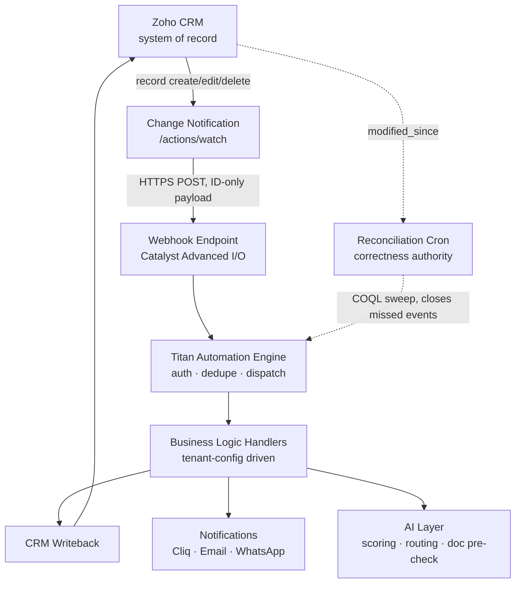

# Titan — Event-Driven Architecture Review

**Type:** CTO-level design review · **Status:** Complete, decision recommended · **Date:** 2026-07-23
**Scope:** Validate or reject event-driven automation as Titan's platform mechanism, before any implementation.
**Outcome:** Architecture **C (Hybrid)** recommended — see Phase 5. A and B are rejected with reasons.

> **Evidence classes.** Every claim below carries one:
> **[DOC]** official Zoho documentation (URL cited) · **[LIVE]** proven against our production org
> · **[INF]** reasoned inference, explicitly marked · **[UNKNOWN]** cannot be established — no
> guessing. A design decision resting on an [UNKNOWN] must carry a compensating control.

---

# PHASE 1 — FEASIBILITY: COMPONENT SPECIFICATION

## 1. Zoho CRM — event source & system of record

| Aspect | Specification |
|---|---|
| **Responsibilities** | Master data for Leads/Contacts/Student Cases; emits record lifecycle events; enforces validation, sharing, dedupe |
| **Inputs** | API writes (our code), console edits (humans), form submissions |
| **Outputs** | Change notifications (IDs only); authoritative record state via REST |
| **Failure modes** | CRM outage; API credit exhaustion; `TOO_MANY_REQUESTS`; validation rejection on writeback |
| **Retry** | Client-side: `retryAsync` with linear backoff on transient codes only (`INTERNAL_ERROR`, `RATE_LIMIT_EXCEEDED`, `REQUEST_TIMEOUT`) **[LIVE]** — already implemented in `http.mjs` |
| **Auth** | OAuth 2.0 refresh-token grant; per-DC accounts host **[LIVE]** |
| **Rate limits** | Enterprise/Zoho One: `50,000 + (users × 1,000)` credits/day, cap 5,000,000; **20 concurrent** calls/org/app; sub-concurrency 10 for heavy ops **[DOC]** |
| **Scalability** | Credits are not the binding constraint (Phase 6 cost model); **concurrency (20) is** |
| **Security** | India DC; PII never leaves Zoho (ADR-003); secrets in env only, never logged (`redact()`) **[LIVE]** |
| **Observability** | API response codes; credit usage in Setup; our own structured logs |

## 2. Change Notification — `/actions/watch`

| Aspect | Specification |
|---|---|
| **Responsibilities** | Subscribe to module events; POST a notification to `notify_url` on each event |
| **Inputs** | `{watch:[{channel_id, events, notify_url, token?, channel_expiry?, notification_condition?, return_affected_field_values?, notify_on_related_action?}]}` **[DOC]** |
| **Outputs** | POST body: `{server_time, query_params, module, resource_uri, ids[], affected_fields[], operation, channel_id, token}` **[DOC]** |
| **Events** | `"{module_api_name}.{operation}"`, operations `create`/`edit`/`delete`/`all` **[DOC]** |
| **Failure modes** | Channel expiry (silent stop); delivery failure; **[UNKNOWN]** retry/loss behaviour |
| **Retry** | **[UNKNOWN]** — not documented anywhere in the v8 reference or Kaizen deep-dive. **This is the single most consequential gap in the design** |
| **Auth** | Subscription: `ZohoCRM.notifications.{ALL\|WRITE\|CREATE}` **[DOC]**. Delivery: `token` (≤50 chars) echoed in body — **verification only, not a signature** **[DOC]** |
| **Rate limits** | ≤100 channels per create call; ≤200 channels fetched per call **[DOC]**. No documented cap on total channels **[DOC]** |
| **Scalability** | One channel per (module, event-set) per tenant; tenant count scales channels linearly |
| **Security** | Weak sender authentication (shared secret, no HMAC). Mitigated by ID-only payload — see Phase 3 R7 |
| **Observability** | `GET /actions/watch` lists channels + expiry — the basis of drift detection |

## 3. Webhook endpoint — Catalyst Advanced I/O function

| Aspect | Specification |
|---|---|
| **Responsibilities** | Terminate HTTPS; verify `token` + `channel_id`; enqueue/dispatch; **return 200 fast** |
| **Inputs** | Zoho notification POST |
| **Outputs** | HTTP 200 (ack); dispatch to engine |
| **Failure modes** | Cold start latency; 30s timeout; concurrency 429; endpoint down → event lost **[INF]**, since retry is [UNKNOWN] |
| **Retry** | Must not rely on Zoho retrying. **Ack immediately, process asynchronously**; correctness comes from reconciliation |
| **Auth** | Constant-time compare of `token`; reject unknown `channel_id` |
| **Rate limits** | Basic/Advanced I/O **30s** timeout; ~**1500 concurrent** (prod) for a 10ms function **[DOC]** |
| **Scalability** | Serverless autoscale; concurrency far exceeds CRM's own 20-call write ceiling |
| **Security** | HTTPS only; no PII in payload; reject non-Zoho source ranges where feasible |
| **Observability** | Request log, latency histogram, 4xx/5xx counters, per-channel counts |

## 4. Catalyst Function — runtime

| Aspect | Specification |
|---|---|
| **Responsibilities** | Host handler code; provide env config, scheduling (Cron), and data store for idempotency keys |
| **Inputs** | Event payload; tenant config; Zoho credentials from env |
| **Outputs** | CRM writes, notifications, logs, metrics |
| **Failure modes** | Cold start; 30s (I/O) / 15min (Event/Cron) timeout **[DOC]**; memory cap 1GB, default 128MB **[DOC]**; deploy regression |
| **Retry** | Internal: `retryAsync` on transient CRM errors. External: reconciliation cron |
| **Auth** | Catalyst-managed env vars hold the Zoho refresh token; no secret in code **[LIVE pattern]** |
| **Rate limits** | 1500 concurrent prod / 1000 dev (10ms fn) **[DOC]** |
| **Scalability** | Horizontal, automatic. Not the bottleneck |
| **Security** | **India DC available** (EU/AU/IN/JP/SA/CA) **[DOC]** — DPDP residency preserved |
| **Observability** | Catalyst logs + our structured JSON; export to Cliq `#ops-alerts` |

## 5. Titan Automation Engine — dispatcher

| Aspect | Specification |
|---|---|
| **Responsibilities** | Authenticate event; **deduplicate**; resolve tenant; hydrate record from CRM; route to handler; record outcome |
| **Inputs** | `{module, ids[], operation, channel_id, token}` |
| **Outputs** | Handler invocations; audit record per event |
| **Failure modes** | Duplicate delivery; unknown tenant; hydration failure (record deleted before fetch); handler exception |
| **Retry** | Per-handler retry with backoff; poison events routed to a dead-letter store, never silently dropped |
| **Auth** | Token verification; tenant resolved from `channel_id` → tenant map |
| **Rate limits** | Must respect CRM's 20-concurrency ceiling — a semaphore, not unbounded fan-out |
| **Scalability** | Stateless; tenant-sharded by config |
| **Security** | Tenant isolation enforced at dispatch (Phase 3 R11) |
| **Observability** | Event id, tenant, module, handler, duration, outcome — one structured line per event |

## 6. Business Logic Handlers

| Aspect | Specification |
|---|---|
| **Responsibilities** | Implement AM0.4/AM1.x behaviour: assignment, language-aware templates, stage transitions, deadlines |
| **Inputs** | Hydrated record + `config/tenant-*.json` |
| **Outputs** | CRM field updates, tasks, notifications |
| **Failure modes** | Config drift; partial failure mid-handler; **infinite loop** (write triggers own event) |
| **Retry** | Idempotent by construction (guard field / audit check before acting) |
| **Auth** | Inherits engine context |
| **Rate limits** | Batch CRM writes (1 credit per 10 records **[DOC]**) rather than per-record calls |
| **Scalability** | Pure functions over config — same code, every tenant |
| **Security** | No cross-tenant data access; config is the only tenant-variable input |
| **Observability** | Decision log: which rule fired, why, what changed |

## 7. CRM Writeback · 8. Notifications · 9. AI Layer

| Component | Responsibilities | Key failure mode | Mitigation |
|---|---|---|---|
| **CRM Writeback** | Persist outcomes (owner, status, timestamps) | Triggers a new event → **loop risk** | Loop-breaker: skip events whose last modifier is the automation user (Phase 3 R9) |
| **Notifications** | Cliq `#leads`/`#wins`/`#ops-alerts`, email, WhatsApp (AM0.9) | Cliq duplicate-create (no delete API) **[LIVE, INC-2]** | `provisionChannels()` lists-then-creates, aborts if unreadable **[LIVE]** |
| **AI Layer** | Lead scoring, routing hints, document pre-check, language selection | Latency/cost; hallucination on eligibility advice | Async (never in the 30s webhook path); human-in-loop for any advice affecting a visa decision |

---

# PHASE 2 — VALIDATION

| # | Claim to prove | Verdict | Evidence |
|---|---|---|---|
| 1 | `actions/watch` exists and is reachable | **PROVEN** | `GET /crm/v8/actions/watch` → `401 OAUTH_SCOPE_MISMATCH`; control path `/crm/v8/actions/definitelybogus` → `404 INVALID_URL_PATTERN`. Different responses ⇒ real endpoint **[LIVE]** |
| 2 | It is a documented, GA product surface | **PROVEN** | Documented across v2→v8 with 6 endpoints (enable, get, update details, update info, disable, disable specific) **[DOC]** |
| 3 | Auth model | **PROVEN** | Subscribe: `ZohoCRM.notifications.{ALL\|WRITE\|CREATE}`. Delivery: `token` ≤50 chars echoed in body, *verification only* **[DOC]** |
| 4 | Payload schema | **PROVEN** | `{server_time, query_params, module, resource_uri, ids[], affected_fields[], operation, channel_id, token}` **[DOC]**. Note: subscription uses `create`, payload reports `"operation":"insert"` **[DOC]** — handlers must map both |
| 5 | Subscription limits | **PARTIAL** | ≤100 channels/create call, ≤200 fetched/call **[DOC]**. Total-channel cap **[UNKNOWN]** — not documented |
| 6 | Renewal behaviour | **CONFLICTED** ⚠️ | v8 reference: expiry max **one week**, default **one hour** if unset/exceeded **[DOC]**. Kaizen #14 and Vertical Solutions v6: max **one day** **[DOC]**. **Two official sources disagree on a correctness-critical parameter** |
| 7 | Delivery guarantees | **UNKNOWN** ⚠️⚠️ | Neither the v8 reference nor the Kaizen deep-dive states any delivery guarantee |
| 8 | Retry behaviour on failure | **UNKNOWN** ⚠️⚠️ | Not documented. Whether Zoho retries, how often, or disables channels after failures is unstated |
| 9 | Duplicate delivery | **UNKNOWN** ⚠️ | Not documented. **Must assume at-least-once** [INF] — the only safe assumption |
| 10 | Ordering guarantees | **UNKNOWN** ⚠️ | Not documented. **Must assume unordered** [INF] |
| 11 | Tenant isolation | **PROVEN (by construction)** | Channels are per-org, created with that org's OAuth token; `channel_id`+`token` bind a delivery to one tenant **[DOC]** |
| 12 | Catalyst India DC (DPDP) | **PROVEN** | Catalyst available in EU/AU/**IN**/JP/SA/CA **[DOC]** |
| 13 | Catalyst execution limits | **PROVEN** | 30s (Basic/Advanced I/O), 15min (Event/Cron); ≤1GB memory, 128MB default; ~1500 concurrent prod **[DOC]** |
| 14 | CRM API capacity | **PROVEN** | `50,000 + users×1,000`/day (cap 5M); **20 concurrent**/org; sub-concurrency 10 **[DOC]** |

### Verdict on production-readiness

**`actions/watch` is a mature, documented, GA API — but its reliability characteristics are undocumented.**
Items 7–10 are all [UNKNOWN], and item 6 is actively contradictory between official sources.

This does **not** reject event-driven architecture. It rejects **event-driven architecture used as the
sole source of truth**. Every mature event system assumes at-least-once, unordered delivery with
possible loss; the standard remedy is idempotent handlers plus reconciliation. What the evidence
forbids is betting a visa deadline on a notification we cannot prove will arrive.

---

# PHASE 3 — RISK REVIEW

| # | Risk | Likelihood | Impact | Mitigation |
|---|---|---|---|---|
| **R1** | **Expired watch channel** → automation stops **silently** | High (certain without renewal) | Critical | Renew at ≤¼ of the *shortest* documented expiry (i.e. treat max as **1 day**, renew every 6h). CI gate enforces `renewal_hours ≤ expiry_hours/2` **[LIVE]**. Alert if any channel's expiry < 2 renewal windows |
| **R2** | **Duplicate delivery** | Assume certain [INF] | Data corruption (double email, double assignment) | Idempotency key = `hash(module, id, operation, server_time)` in Catalyst Data Store, TTL 7d. Handlers check-then-act |
| **R3** | **Missed events** (delivery loss) | Unknown → assume non-zero | Critical (a lost lead is lost revenue) | **Reconciliation cron** (Phase 6): COQL sweep on `Modified_Time > checkpoint` every 15 min. This — not the event — is the correctness authority |
| **R4** | **Webhook downtime** | Medium | Events lost (no proven retry) | Reconciliation closes the gap. Catalyst multi-instance; health check + `#ops-alerts` page |
| **R5** | **Catalyst downtime** | Low | Automation halted | Reconciliation backfills on recovery. Manual SOP-01 remains the human fallback (AM0.4 §8) |
| **R6** | **CRM downtime** | Low | Total halt | Nothing to mitigate at app layer; document RTO in DR plan; queue outbound writes for replay |
| **R7** | **Replay / forged notification** | Medium | Spurious automation, amplification DoS | Payload is **ID-only** — we always re-fetch from CRM with our own credentials, so a forged event cannot inject data. Reject unknown `channel_id`; constant-time `token` compare; **do not enable `return_affected_field_values`** (keeps payload authority-free); rate-limit per channel |
| **R8** | **Race condition** (two events, same record) | Medium | Lost update | Per-record serialization via idempotency store lock; last-writer-wins only on non-critical fields |
| **R9** | **Infinite update loop** (our write → event → our write) | High if unguarded | Credit exhaustion, runaway cost | Loop-breaker: skip when the record's last-modified-by is the automation user; plus per-record per-hour action cap |
| **R10** | **Partial failure** mid-handler | Medium | Inconsistent state | Handlers ordered so CRM writeback is last and idempotent; dead-letter queue; reconciliation repairs |
| **R11** | **Multi-tenant isolation failure** | Low | **Severe** (cross-org PII leak) | One channel + one credential set per tenant; `channel_id → tenant` map is authoritative; assert resolved tenant matches the credential used for hydration; integration test that a tenant-A event can never read tenant-B data |
| **R12** | **Idempotency store failure** | Low | Duplicates resurface | Fail-closed: if the store is unavailable, defer the event to reconciliation rather than risking a double-send |
| **R13** | **Expiry documentation conflict** (1 week vs 1 day) | Certain (already exists) | Silent stop | Design to the **shorter** value; empirically measure actual expiry in staging and record it as [LIVE] evidence |
| **R14** | **CRM concurrency (20) exhausted** by fan-out | Medium at scale | `TOO_MANY_REQUESTS`, dropped work | Semaphore capped below 20; batch writes (1 credit/10 records); shed to reconciliation under pressure |

---

# PHASE 4 — ARCHITECTURE COMPARISON

**A** = Native Zoho Workflow Rules · **B** = Watch API → Catalyst (events only) · **C** = Hybrid (events + reconciliation, with a temporary native fallback)

| Dimension | A — Workflow Rules | B — Events only | C — Hybrid |
|---|---|---|---|
| **Scalability** | Poor: console limits, no batching | Good: serverless autoscale | Good: same as B |
| **Maintainability** | Poor: logic in a UI, no diff/review | Excellent: code, tested | Excellent |
| **Deployment** | ❌ Manual clicks only **[LIVE-proven]** | ✅ One idempotent API call | ✅ Same, + cron |
| **Reproducibility** (per tenant) | ❌ **Impossible without human** | ✅ Config-driven | ✅ Config-driven |
| **AI integration** | ❌ Console forms can't express it | ✅ Native | ✅ Native |
| **Debugging** | Poor: no logs, no local repro | Good: structured logs, replayable | **Best**: reconciliation exposes gaps |
| **Cost** | Included in licence | Catalyst GB-s + CRM credits (Phase 6: negligible) | Marginally > B (cron sweeps) |
| **Operational complexity** | Low (until it breaks silently) | Medium: renewal, idempotency | **Higher**: + reconciliation, checkpoints |
| **Vendor lock-in** | **Total** — logic trapped in Zoho UI | Moderate: handlers are portable JS; only the trigger is Zoho | Moderate, same as B |
| **Multi-country** | Poor: duplicate rules per variation | Excellent: config-driven geography | Excellent |
| **Multi-tenant** | ❌ Not viable | ✅ Viable | ✅ Viable |
| **Correctness under delivery loss** | ✅ Zoho-internal (no network hop) | ❌ **Unproven — [UNKNOWN] guarantees** | ✅ Reconciliation is authoritative |

---

# PHASE 5 — DECISION

## Recommended: **Architecture C — Hybrid**

Defined precisely (this is *not* "workflows plus watch"):

1. **Primary path — events.** `actions/watch` → Catalyst → Titan engine → handlers. Delivers the
   latency the product needs (speed-to-lead in seconds) and the reproducibility the platform needs.
2. **Correctness authority — reconciliation.** A Catalyst Cron sweep (COQL on `Modified_Time >
   checkpoint`, every 15 min) detects and processes anything the event path missed. **The system is
   correct because of reconciliation, and fast because of events.**
3. **Temporary fallback — one native workflow rule.** A single console-configured
   acknowledgment email on `Leads.create`, retained **only** through the migration window, retired
   once event delivery is empirically measured over 30 days. Its cost is one manual setup per tenant;
   its benefit is that a total event-path failure still leaves the customer acknowledged.

### Why A is rejected
Workflow rules **cannot be provisioned via API** — proven live: rules and criteria are creatable on
v8, but every rule requires an action entity, and action entities are read-only
(`POST /settings/automation/tasks` → `INVALID_REQUEST`) **[LIVE]**. A platform whose automation layer
requires a human with a mouse for every tenant cannot serve multiple organizations. It is also
untestable, un-reviewable, un-rollback-able, and caps logic at what a console form expresses —
which excludes the AI layer that is the product thesis.

### Why B is rejected
Not on capability — on **provable correctness**. Delivery guarantees, retry, duplicate and ordering
behaviour are all **[UNKNOWN]**, and the two official sources on channel expiry **contradict each
other**. An architecture whose sole data path has undocumented loss characteristics is not
acceptable for records that carry visa deadlines and document status. B becomes acceptable the
moment reconciliation is added — at which point it *is* C.

### Condition on the decision
This recommendation is **conditional on empirical validation in staging** (Phase 6, Stage 1). If
measured delivery reliability is materially worse than assumed, the reconciliation interval tightens
(15 min → 5 min) and the native fallback is retained permanently rather than retired.
