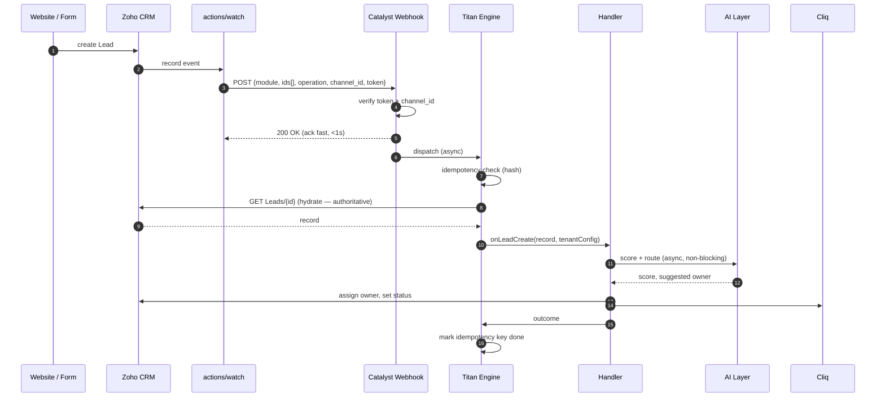
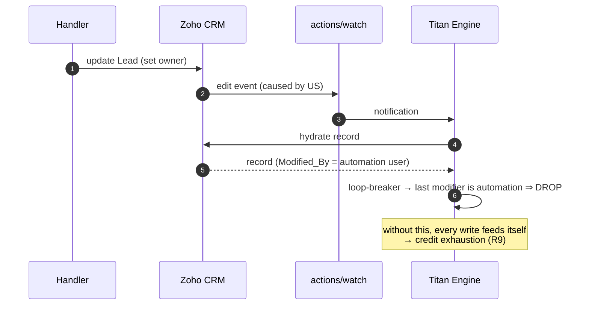
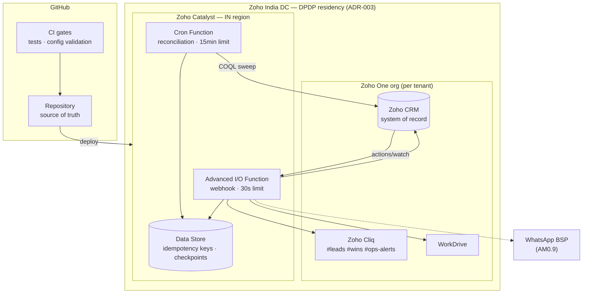

# Titan — Phase 6: System Design, Operations & Roadmap

Companion to [titan-event-architecture-review.md](titan-event-architecture-review.md) (Phases 1–5).
**No production writes. No implementation.** Design artefacts only.
Applies to Architecture **C (Hybrid)** as recommended in Phase 5.

---

## 1. SEQUENCE DIAGRAMS

### 1.1 Happy path — new lead (speed-to-lead)



### 1.2 Failure path — missed event closed by reconciliation

```mermaid
sequenceDiagram
    autonumber
    participant CRM as Zoho CRM
    participant N as actions/watch
    participant CF as Catalyst Webhook
    participant R as Reconciliation Cron
    participant E as Titan Engine

    CRM->>N: record event
    N--xCF: delivery lost (no proven retry — UNKNOWN)
    Note over CF: event never arrives; no error surfaces anywhere
    loop every 15 minutes
        R->>CRM: COQL: Modified_Time > checkpoint
        CRM-->>R: records changed since checkpoint
        R->>E: dispatch any not already processed
        E->>E: idempotency check → not seen → process
        R->>R: advance checkpoint only after success
    end
```

### 1.3 Loop-breaker — our own write must not retrigger us



---

## 2. DEPLOYMENT DIAGRAM



**Residency:** all PII stays in the India DC — CRM (`zohoapis.in`) and Catalyst (IN region) **[DOC]**.
No student data transits a non-Indian region. Website tier remains stateless (ADR-003).

---

## 3. ROLLBACK STRATEGY

| Layer | Rollback | RTO | Notes |
|---|---|---|---|
| **Event subscriptions** | `provision-notifications.mjs --rollback --commit` deletes all channels | < 1 min | Already built + tested |
| **Catalyst function** | Redeploy previous version | < 5 min | Catalyst retains versions |
| **CRM schema (fields)** | `provision-crm.mjs --rollback --commit` (deletes only `custom_field:true`) | < 5 min | Built + tested |
| **CRM pipeline** | Re-apply previous `crm-schema.json` via `provision-pipeline.mjs --commit` (atomic full-set) | < 5 min | Git revert → re-run |
| **CRM records** | Recycle Bin (~60 days) | manual | Zoho-provided |
| **Cliq channels** | ❌ **No rollback** — no delete API **[LIVE]** | — | Prevention only (list-then-create) |
| **Full disable** | Delete all channels → system falls back to manual SOP-01 | < 1 min | The master kill-switch |

**Kill-switch principle:** deleting watch channels stops all automation without touching data. CRM
remains fully usable by humans. This is the safest possible failure posture.

---

## 4. OPERATIONAL RUNBOOK

### 4.1 Routine

| Cadence | Action | Command / check |
|---|---|---|
| Every 6h | Renew watch channels | `provision-notifications.mjs --commit` (idempotent: renews only what's near expiry) |
| Every 15 min | Reconciliation sweep | Catalyst Cron |
| Daily | Production drift audit | `release-audit.mjs` |
| Daily | Acceptance re-verify | `verify-crm.mjs` |
| Weekly | Credit usage review | CRM Setup → API usage vs `50,000 + users×1,000` |
| Per release | Full gate | tests · config validators · build · claims-guard · link-check |

### 4.2 Incident procedures

**"Automation stopped — no errors anywhere" (most likely incident, R1)**
1. `GET /actions/watch` — do channels exist? What's their expiry?
2. If expired/absent → `provision-notifications.mjs --commit`; confirm read-back.
3. Check reconciliation checkpoint age — if stale, the cron is also down (that's why both exist).
4. Backfill: reconciliation processes the gap automatically once restored.
5. File an incident: why did renewal not run?

**"Duplicate emails / double assignment" (R2)**
1. Confirm duplicate `server_time`+`id` in the event log.
2. Check idempotency store health — fail-closed should have deferred, not duplicated.
3. Suspend the affected handler (config flag), repair, replay from dead-letter.

**"Runaway credit consumption" (R9)**
1. Kill-switch: delete watch channels immediately.
2. Inspect for loop: records with many automation-authored modifications in a short window.
3. Verify loop-breaker (last-modifier check) and per-record action cap.
4. Do not re-enable until a regression test reproduces the loop.

**"Cross-tenant data appears" (R11) — SEV-1**
1. Kill-switch all channels immediately.
2. Preserve logs; identify the `channel_id → tenant` resolution that failed.
3. Treat as a data-protection incident under DPDP; assess notification duty.
4. No re-enable without an integration test proving isolation.

---

## 5. MONITORING STRATEGY

| Signal | Metric | Alert threshold | Detects |
|---|---|---|---|
| **Channel expiry headroom** | min(expiry − now) across channels | < 2 renewal windows | R1 silent stop |
| **Event volume** | notifications/hour vs 7-day baseline | drop > 50% | Delivery failure, expired channel |
| **Reconciliation yield** | records found by cron *that events missed* | **> 0 sustained** | **The key SLI** — quantifies event-path loss |
| **Checkpoint age** | now − last successful checkpoint | > 45 min | Cron failure |
| **Webhook latency** | p95 handler ack time | > 3s | Cold-start / capacity |
| **Webhook errors** | 4xx/5xx rate | > 1% | Auth failures, forged requests |
| **Duplicate rate** | idempotency-key collisions | > baseline | R2 |
| **CRM credits** | daily consumed / allowance | > 70% | Loop or scale pressure |
| **CRM concurrency** | `TOO_MANY_REQUESTS` count | > 0 | R14 fan-out |
| **Dead-letter depth** | unprocessed poison events | > 0 | Silent data loss |

**Reconciliation yield is the most important metric in the system.** It is the only way to
empirically measure what the documentation refuses to state (Phase 2, items 7–10). A sustained
non-zero yield *is* the proof that events alone are insufficient — and its trend over 30 days
decides whether the native fallback is retired.

All alerts route to Cliq `#ops-alerts` (already provisioned **[LIVE]**).

---

## 6. DISASTER RECOVERY

| Scenario | RPO | RTO | Procedure |
|---|---|---|---|
| Catalyst region outage | 0 (CRM is SoR) | Zoho-dependent | Automation halts; humans use SOP-01; reconciliation backfills on recovery |
| Watch channels lost | 0 | < 5 min | Re-provision from `config/automation-events.json` |
| CRM outage | Zoho-dependent | Zoho-dependent | No app-layer mitigation; outbound writes queued for replay |
| Idempotency store loss | duplicates possible | < 15 min | Rebuild empty; accept a duplicate window; handlers re-check CRM before acting |
| Repository loss | **currently total** ⚠️ | — | **No git remote is configured.** See Risk below |
| Credential compromise | — | < 10 min | Revoke refresh token in API console; re-mint with least-privilege scopes |
| Accidental schema damage | 0 | < 5 min | `--rollback` provisioners; git revert; re-apply |

> ⚠️ **Highest-severity DR gap today is not in Titan — it is that 24 commits of verified work exist on
> one laptop with no remote.** Every other DR path above is designed; this one is absent. Configuring
> a remote is the cheapest risk reduction available to this project.

---

## 7. COST ANALYSIS

**Model:** 10,000 students/yr, 50,000 leads/yr, ~5 events per lead lifecycle ⇒ **250,000 events/yr ≈ 685/day ≈ 0.5/min**.

| Cost driver | Consumption | Allowance | Headroom |
|---|---|---|---|
| **CRM API credits** | ~5 credits/lead lifecycle (hydrate + update + note, batched at 1 credit/10 records) → ~**3,400/day** | `50,000 + users×1,000` = **57,000/day** at 7 users **[DOC]** | **~17×** |
| **CRM concurrency** | Peak ~2–3 concurrent | **20** **[DOC]** | ~7× — *the binding constraint at scale, not credits* |
| **Catalyst functions** | ~685 invocations/day × ~500ms × 128MB ≈ **0.04 GB-h/day** | Billed GB-second **[DOC]** | Negligible at this volume |
| **Reconciliation cron** | 96 sweeps/day × ~2 credits = **~200 credits/day** | — | Negligible |
| **Cliq** | Included in Zoho One | — | — |

**Conclusion:** cost is **not** a differentiator between architectures at target scale. The economic
argument for C over A is engineering cost (reproducibility, debuggability), not runtime cost.
**Scaling limit reached first: CRM concurrency (20), at roughly 10× current projected volume.**

---

## 8. FUTURE SCALABILITY PLAN

| Horizon | Trigger | Action |
|---|---|---|
| **Now → 10k students** | — | Current design suffices; concurrency headroom ~7× |
| **10k → 100k** | `TOO_MANY_REQUESTS` appears | Introduce a queue between webhook and handlers; batch CRM writes aggressively (1 credit/10 records); raise edition if credits bind |
| **Multi-tenant (2nd org)** | 2nd tenant onboards | `config/tenant-*.json` per tenant + per-tenant credentials; `channel_id → tenant` map becomes a store, not a constant; **tenant-isolation integration test is a merge gate** |
| **Multi-country** | New destination/market | Already config-driven (`destinations`, `markets`, `languages`) — no code change by design |
| **AI expansion** | Scoring proven | Move AI fully async behind a queue; never in the 30s webhook path |
| **Beyond Zoho** | Vendor risk materialises | Handlers are portable JS; only the trigger and SoR are Zoho-specific. Migration = replace trigger + data layer, keep business logic |

---

## 9. PHASED MIGRATION ROADMAP

**No stage begins until the previous stage's exit criteria are met and evidenced.**

| Stage | Scope | Exit criteria | Reversible? |
|---|---|---|---|
| **0 — Prerequisites** | Catalyst project (IN region); `ZohoCRM.notifications.ALL` scope; git remote | Catalyst reachable over HTTPS; `GET /actions/watch` returns 200 | n/a |
| **1 — Empirical validation** ⭐ | Subscribe **one** channel (`Leads.create`) in a **sandbox/staging** org. Measure for 7 days: actual expiry, duplicate rate, loss rate, ordering | **The [UNKNOWN]s of Phase 2 become [LIVE] measurements.** Documented delivery-loss figure exists | Delete channel |
| **2 — Shadow mode** | Handlers run in production but **write nothing** — log intended actions only. Compare against existing manual outcomes | 0 incorrect intended actions over 500 events | Stop function |
| **3 — One live handler** | Enable `onLeadCreate` writeback only. Native ack rule stays | Speed-to-lead < 60s p95; reconciliation yield ≈ 0; no duplicates | `--rollback` |
| **4 — Remaining handlers** | Case stage changes, deadlines, escalations | All AM0.4 behaviours live; A10–A13 acceptance evidence | Per-handler flag |
| **5 — Retire fallback** | Remove the native workflow rule | 30 days of reconciliation-yield data justifying it | Recreate rule |
| **6 — Tenant 2** | Onboard a second org from config alone | Zero code changes required; isolation test green | Per-tenant disable |

**Stage 1 is the gate on the entire architecture.** It converts the four [UNKNOWN] verdicts in Phase 2
into measured facts. If measured loss is material, Stage 5 never happens and the fallback becomes
permanent — a decision made on data, not on Zoho's silence.
