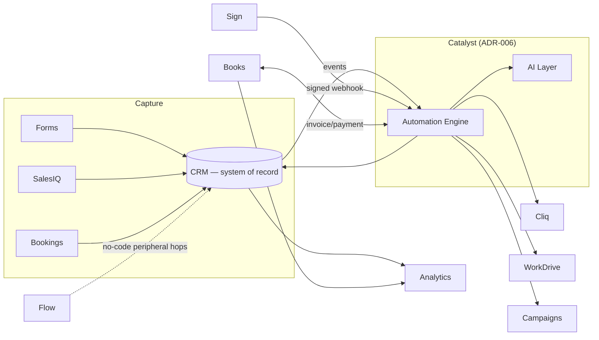

# RichenQuest — Zoho One Ecosystem Strategy

**Type:** CTO decision document · **Status:** Authoritative · **Date:** 2026-07-24
**Purpose:** Decide which Zoho One applications RichenQuest actually adopts, each with a business
reason, integration approach, and phase. Consolidates decisions previously scattered across Files
15–16 and the AM0.x backlog into one source of truth.

> **Selection rule (founder directive):** an app is adopted only when it creates *measurable
> operational value* for an education/immigration consultancy. "It's included in Zoho One" is not a
> reason. Every SKIP below is a deliberate decision with a trigger for revisiting it.

---

## 1. The business we are building for

RichenQuest guides students from India / Nepal (and later Pakistan) into European universities. The
work is **document-heavy, deadline-driven, and trust-based**: passports, transcripts, APS
verification, offer letters, visa files. Revenue is milestone/service-fee, not subscription or
product sales. Team is 7 today, designed to scale to 100k+ students across multiple countries
(Tenant Zero of the Titan platform).

Two facts shape every integration choice:
- **CRM is the system of record** (ADR-003). No app duplicates CRM master data.
- **Automation is event-driven code, not console config** (ADR-006). Apps integrate through
  Catalyst functions and CRM events, with Flow reserved for simple no-code hops.

---

## 2. Decision matrix

**Tiers:** 🟢 Core (adopt now, on the critical path) · 🔵 Valuable (clear ROI, scheduled) ·
🟡 Situational (adopt on a named trigger) · ⚪ Skip (no RichenQuest value now).

| App | Tier | Business purpose for RichenQuest | Journey stage | Integration | Phase |
|---|---|---|---|---|---|
| **CRM** | 🟢 Core | System of record: leads, student cases, pipeline | All | native + API (built) | ✅ done |
| **Catalyst** | 🟢 Core | Backend runtime: automation engine, AI services, webhooks | All | our code | B3 |
| **Cliq** | 🟢 Core | Team ops + automation alerts (#leads/#wins/#ops-alerts) | All | API (built) | ✅ done |
| **Mail** | 🟢 Core | Official domain email; transactional + partnership mail | All | API + DNS (done) | ✅ done |
| **WorkDrive** | 🟢 Core | Student document vault (passports, transcripts, APS, offers) | Documents→Visa | API, per-student folders | AM0.6 |
| **Sign** | 🟢 Core | E-signature on the service agreement — **it IS a pipeline stage** | Agreement Signed | API + CRM webhook | Phase 2 |
| **Books** | 🟢 Core | Invoicing, GST, payment reconciliation (Razorpay) | Agreement→Won | API | AM0.5 |
| **Forms** | 🔵 Valuable | Website inquiry capture → CRM Lead (feeds speed-to-lead) | New Inquiry | embed + webhook | Phase 2 |
| **Bookings** | 🔵 Valuable | Counseling appointment scheduling | Counseling Booked | embed + API | Phase 2 |
| **SalesIQ** | 🔵 Valuable | Website live chat + AI chatbot surface → lead capture | New Inquiry | widget + API | Phase 2/4 |
| **Campaigns** | 🔵 Valuable | Nurture: stale-lead rescue, intake reminders, testimonials | New Inquiry / Won | API | Phase 2 |
| **Analytics** | 🔵 Valuable | Founder funnel dashboard, counselor performance, cohort metrics | All | CRM/Books connectors | AM0.10 |
| **Vault** | 🔵 Valuable | Shared-credential security for the team | Cross-cutting | native | AM0.7 |
| **Flow** | 🟡 Situational | No-code glue for peripheral apps where a Catalyst fn is overkill | Cross-cutting | native | as-needed |
| **Writer** | 🟡 Situational | Mail-merge SOPs, visa cover letters, offer summaries from CRM | Applications/Visa | API + templates | Phase 3 |
| **Desk** | 🟡 Situational | Student support ticketing once post-enrolment volume grows | Post-Won | API + CRM link | Phase 3 |
| **Creator** | 🟡 Situational | Low-code student/counselor portal — **vs Catalyst** (decide once) | Portal | evaluate | Phase 3 gate |
| **Projects** | 🟡 Situational | Internal partnership pipeline / content calendar | Internal | native | trigger: >10 partnerships |
| **Contracts** | 🟡 Situational | CLM for university partnership agreements (beyond Sign) | B2B | native | trigger: multi-university |
| **People** | ⚪ Skip | Full HRMS — overkill at 7 staff | — | — | trigger: ~20+ staff |
| **Recruit** | ⚪ Skip | ATS — not hiring at scale now | — | — | trigger: scaled hiring |
| **Expense** | ⚪ Skip | Books already records expenses at this size | — | — | trigger: field/travel teams |
| **Billing** | ⚪ Skip | Subscription billing — revenue is service-fee, not subscription | — | — | trigger: subscription product |
| **Inventory** | ⚪ Skip | Physical-goods stock — services business, no inventory | — | — | none foreseen |
| **Commerce** | ⚪ Skip | E-commerce storefront — RichenQuest sells guidance, not products | — | — | none foreseen |

---

## 3. Why the Core seven, specifically

- **CRM + Catalyst + Cliq + Mail** — already argued in ADR-003/006 and largely built. The spine.
- **WorkDrive is not optional for this business.** An immigration file is a document pipeline;
  losing or mis-handling a passport scan is an existential trust failure. Per-student folders,
  provisioned automatically on case creation, are core infrastructure — not a "nice to have."
- **Sign maps directly onto the pipeline.** "Agreement Sent → Agreement Signed" is literally an
  e-signature event. Wiring Sign's completion webhook to advance the CRM stage removes a manual step
  from the single most important conversion point in the funnel.
- **Books is revenue.** GST compliance (Indian law) and Razorpay reconciliation are non-negotiable
  the moment money changes hands. Already scheduled as AM0.5.

## 4. The one genuinely open architectural decision

**Student/Counselor portal: Zoho Creator vs Catalyst (Phase 3).** Both can build it. Creator is
faster for CRUD-over-CRM screens with less code; Catalyst gives full control and houses the AI layer
already. This is a real trade-off that should be decided with evidence at Phase 3 start, not now —
premature choice here would be speculative. Recorded as a gate, not a decision.

## 5. Integration architecture (how these connect)

**Principles:** CRM is the hub; Catalyst is the brain; every app either feeds CRM (capture) or is
driven by CRM events (fulfilment). Flow handles only simple hops not worth a function. No app holds
master data that CRM should own.

## 6. Alignment with the existing AM backlog

This strategy does not change the frozen architecture — it consolidates it. Existing backlog items
map cleanly: **AM0.5** = Books, **AM0.6** = WorkDrive, **AM0.7** = Vault, **AM0.9** = WhatsApp BSP
(a Campaigns/SalesIQ-adjacent channel, not a Zoho app), **AM0.10** = Analytics. Forms, Bookings,
SalesIQ, Sign, and Campaigns are folded into Phase 2 automation as event producers/consumers.

## 7. What this explicitly rules out (so effort is not wasted)

People, Recruit, Expense, Billing, Inventory, and Commerce are **not** adopted, each for a stated
reason with a revisit trigger. This is the most valuable part of the document: it prevents
scattering effort across 25 apps when 7 core + 6 valuable ones deliver the platform. Revisit only
when a trigger fires — never because an app exists.
